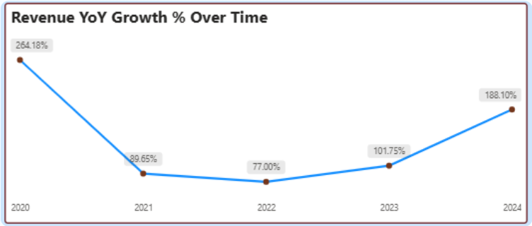
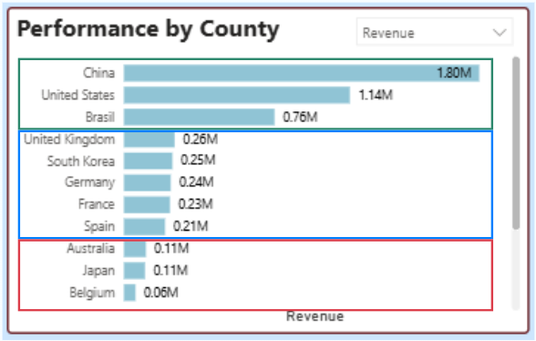
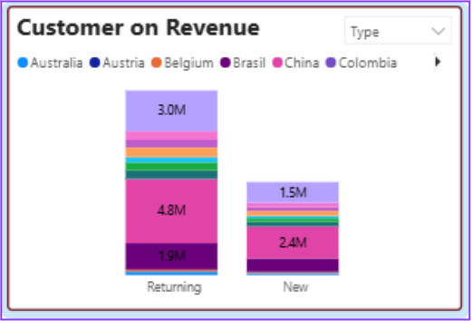
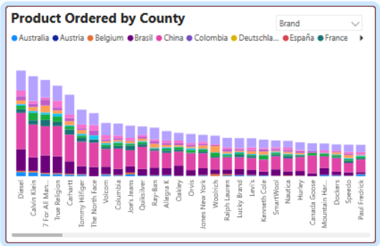

# Performance Analyst in E-Commerce
The company operates in multiple countries, but performance across markets varies significantly. These variations have not been analyzed systematically, making it difficult to:
- Identify high-potential markets
- Detect underperforming regions
- Understand what drives revenue growth
- Formulate a data-driven global expansion strategy

| Category | Details |
|-----------|----------|
| **Objerctive** | to understand market disparities, identify growth opportunities, and uncover key factors that drive revenue across different regions. |
| **Type** | Data Analytics |
| **Tools** | Python (Pandas), Power BI |
| **Dataset** | [Kaggle Looker Ecommerce BigQuery Dataset](https://www.kaggle.com/datasets/mustafakeser4/looker-ecommerce-bigquery-dataset) |

## Analysis Process
- **Data Preparation & Cleaning:** Merged multiple datasets using Python into a single analytical table. Handled missing values, standardized date/time formats, validated categories, and create key metrics.
- **Exploratory Data Analysis (EDA):** Investigated distribution of revenue, customer behavior, and product performance across markets.
- **Data Visualization:** built interactive Power BI dashboard to communicate business insights.  
- **Business Insight & Recommendation:** Delivered strategic recommendations for market prioritization, customer retention, and product mix optimization.
---
## Key Findings
### Revenue Growth Over Time

- Significant decline from 2020–2021 due to **pandemic effects**.
- Strong rebound in 2023–2024 with **188% YoY growth in 2024**. 
 *Action:* Leverage the strong post-pandemic momentum by increasing marketing investment, strengthening local partnerships, ensuring inventory availability.

### Country Performance

- Top Markets: China, United States, Brazil
- Mid-Tier: South Korea, France, UK, Germany, Spain
- Underperforming: Japan, Australia, Belgium, Poland, Colombia, Austria
 *Action:* Prioritize High-Performing Markets by increasing marketing investments in China, the United States, and Brazil. Expand strategic partnerships and optimize logistics to improve market penetration and operational efficiency.

### Customer Behavior

- Majority are returning customers, indicating strong loyalty.
- Dominant age group: 15–64.
 *Action:* Strengthen Customer Retention by developing loyalty programs and offering effective cross-selling and personalized product recommendations.

### Product & Brand Performance

- Top categories: Outerwear & Coat, Jeans, Sweaters, Suit & Sport Coats, Activewear
- Leading brands: Diesel, Calvin Klein, 7 For All Mankind, True Religion, Carhartt
- *Action:* Focus on High-Conversion Categories such as outerwear and jeans, and expand premium brand offerings in strong-performing markets.

## Recommend Future Improvements
- Add RFM analysis for customer segmentation.
- Improve forecasting using Prophet or ARIMA.
- Automate ETL pipeline for continuous updates.
---
## Explore The Interactive Dasboard

👉 [E-Commerce Growth Analysis](https://app.powerbi.com/view?r=eyJrIjoiYzEzMzYxNTYtNmQwZi00NzhiLWIxYWUtNDQyNTYwOGM1YzEzIiwidCI6ImExYjZmMzMyLThlMzEtNDIwMS1hMDNhLTE2MzBmMWRiYTBlNSJ9)
